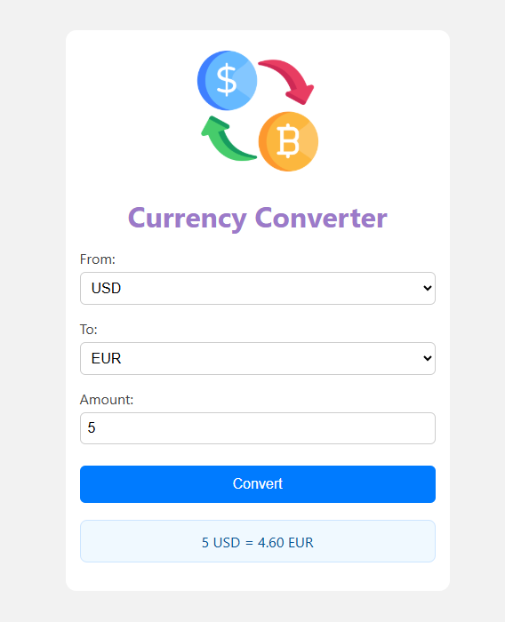

# 💱 Currency Exchange Rate Converter

A simple, interactive web app that lets users convert currency values using predefined exchange rates.

## 📁 About This Project
This version uses a mock rates.json file to simulate API data, making it fully offline and beginner-friendly. For live data, you can later plug in a real API like **exchangerate.host**.

## ✨ Features

- 📊 Converts between multiple currencies using mock exchange rates
- 🔁 Dropdowns to select "From" and "To" currencies
- 🚫 Prevents conversion between same currency

